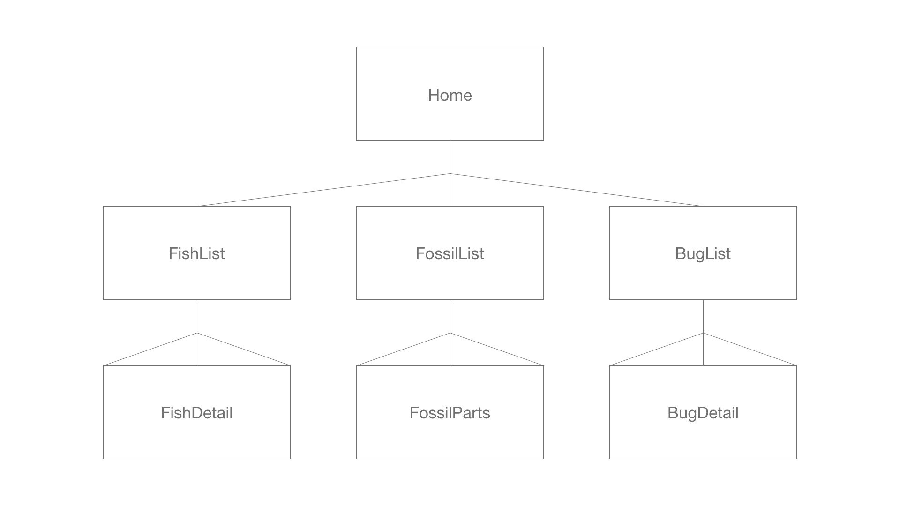
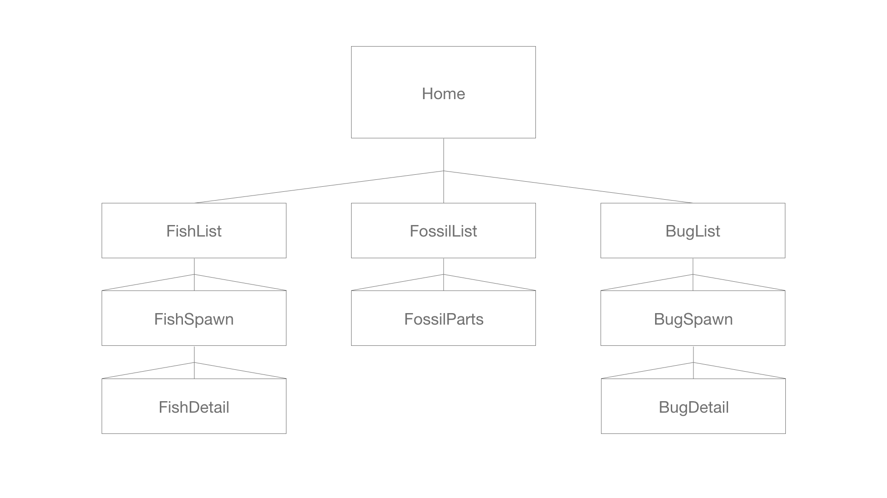
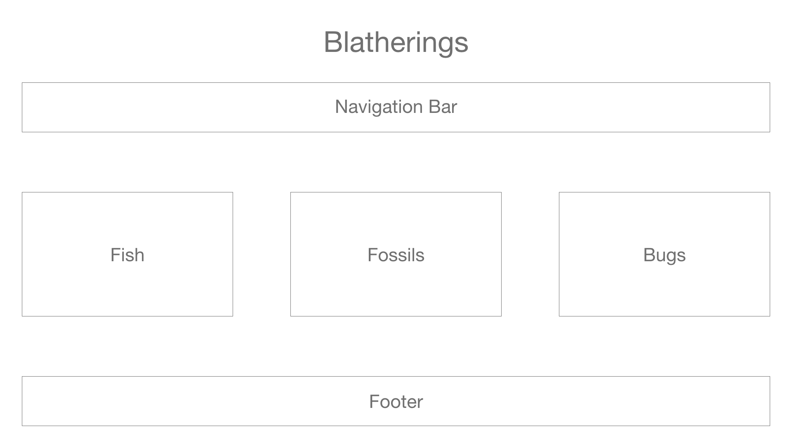
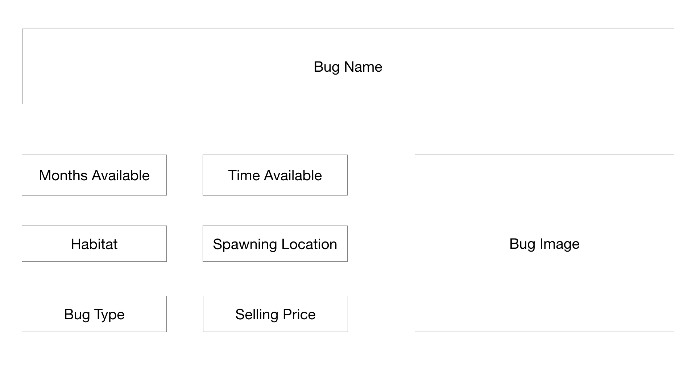
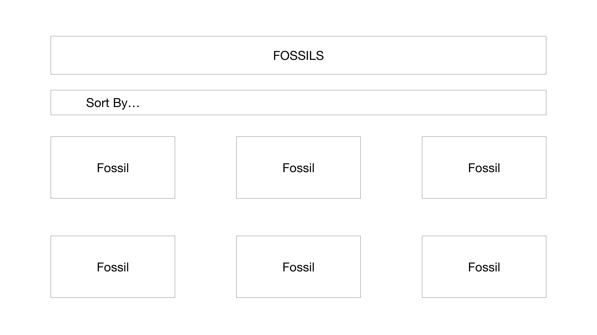
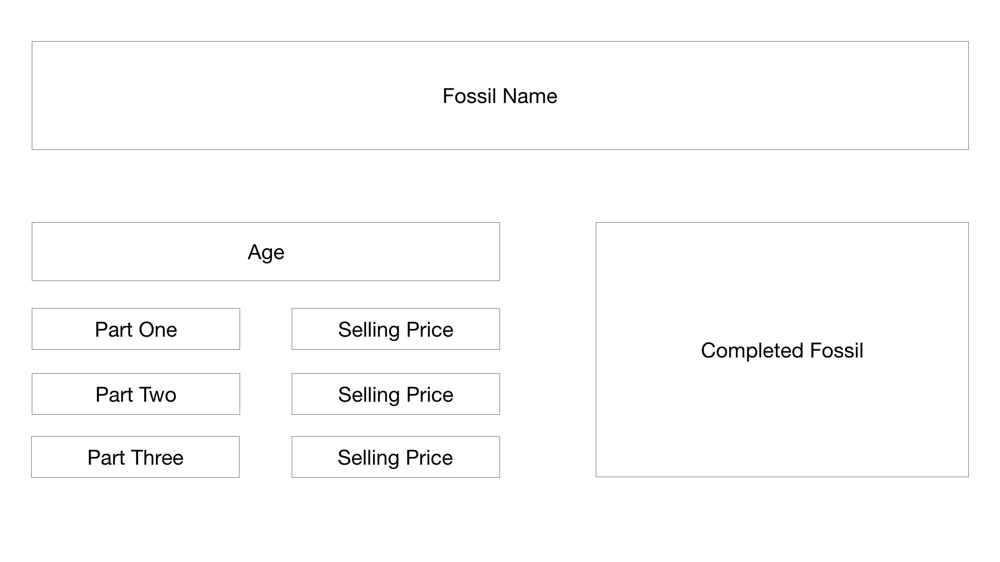

# **BLATHERING**

## ABOUT
I want to create another database of sorts: something in reference to video games. I think because the game just came out, I want to do something with Animal Crossing.
There are hundreds of collectables in the game: fish, bugs, flowers, fruits, clothes, household items, villagers. There is so much to keep track of whenever players are planning their towns.
So I want to make things easier. I want to make an expansive database.
At the minimum, my models will be Fish, Bugs, and Fossils. These are the the three essential collectables that can be donated to the town's museum and can be sold for money.

## Bonus
I can make collections for flower species, fruits (there are only five), and even villagers if I have the time. Another thing I can work on is creating a user profile that allows them to determine if they have donated items to the museum.

## ERD
Minimum Viable Product

Ideal Product

## Wireframes
Home Page

List of Fish

Detailed Fish Page

List of Bugs

Detailed Bug Page

List of Fossils

Detailed Fossil Page
